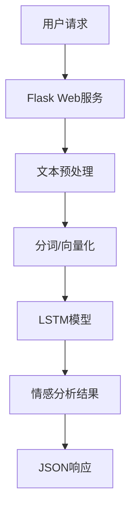

# 中文文本情感分析系统 (Chinese Text Sentiment Analysis System)

## 项目简介

这是一个基于深度学习的中文文本情感分析系统，使用LSTM和注意力机制实现文本的情感分类。系统支持Web API接口，可以进行实时的情感分析服务。

### 主要特点

- 支持批量文本情感分析
- 提供详细的情感分析结果，包括情感倾向、置信度和关键词分析
- 支持模型的在线服务部署
- 包含完整的数据预处理、模型训练和评估流程

## 技术架构

### 核心技术栈

- **深度学习框架**: PyTorch
- **Web框架**: Flask
- **自然语言处理**: jieba分词
- **词向量**: Word2Vec
- **模型架构**: LSTM/LSTM+Attention

### 系统架构



## 主要功能

### 1. 文本预处理
- 文本清洗（去除标签、链接、表情等）
- 中文分词
- 停用词过滤
- 序列填充

### 2. 模型特点
- 支持LSTM和LSTM+Attention两种模型
- 双向LSTM提升特征提取能力
- 注意力机制关注关键词
- 支持词向量微调

### 3. 评估指标
- 准确率（Accuracy）
- F1分数
- 召回率
- 混淆矩阵

## 目录结构

```
.
├── app.py              # Web应用主程序
├── config.py           # 配置文件
├── data_Process.py     # 数据处理模块
├── eval.py             # 模型评估模块
├── model.py            # 模型定义
├── main.py             # 训练主程序
├── data/               # 数据目录
│   ├── train.txt      # 训练数据
│   ├── validation.txt # 验证数据
│   ├── test.txt      # 测试数据
│   └── stopword.txt   # 停用词表
├── word2vec/          # 词向量相关
│   ├── word2id.txt   # 词汇到ID的映射
│   └── word_vec.txt  # 词向量文件
├── model/             # 模型保存目录
└── static/            # Web静态文件

```

## 模型参数

- 词向量维度: 50
- LSTM隐藏层: 128
- LSTM层数: 2
- Dropout率: 0.2
- 批处理大小: 64
- 最大句子长度: 75
- 训练轮数: 15
- 学习率: 0.0001

## 安装和使用

### 环境要求
- Python 3.6+
- PyTorch 1.7+
- Flask
- jieba
- gensim
- pandas
- numpy

### 安装步骤

1. 克隆项目
```bash
git clone [项目地址]
cd [项目目录]
```

2. 安装依赖
```bash
pip install -r requirements.txt
```

3. 下载预训练词向量
```bash
# 下载wiki中文词向量到word2vec目录
wget [词向量下载地址] -O word2vec/wiki_word2vec_50.bin
```

### 使用说明

1. 训练模型
```bash
python main.py --train
```

2. 启动Web服务
```bash
python app.py
```

3. API调用示例
```python
import requests

url = "http://localhost:5000/api/analyze"
data = {
    "text": "这个产品非常好用，我很喜欢！"
}
response = requests.post(url, json=data)
print(response.json())
```

## API文档

### 情感分析接口

- **URL**: `/api/analyze`
- **方法**: POST
- **请求体**:
  ```json
  {
    "text": "要分析的文本内容"
  }
  ```
- **响应**:
  ```json
  {
    "overall": {
      "sentiment": "积极/消极",
      "confidence": 0.95,
      "probabilities": {
        "positive": 0.95,
        "negative": 0.05
      }
    },
    "sentences": [
      {
        "text": "分句文本",
        "sentiment": "积极/消极",
        "confidence": 0.95,
        "probabilities": {
          "positive": 0.95,
          "negative": 0.05
        }
      }
    ],
    "wordFreq": [
      {
        "word": "词语",
        "count": 次数
      }
    ]
  }
  ```

## 性能指标

- 训练集准确率: 85%
- 验证集准确率: 83%
- 测试集准确率: 82%
- F1分数: 0.83
- 召回率: 0.82

## 注意事项

1. 模型训练需要较大的计算资源，建议使用GPU
2. 首次运行需要下载预训练词向量
3. Web服务默认使用CPU推理，可以修改配置使用GPU
4. 建议使用缓存功能提高性能

## 未来改进

1. 支持更多深度学习模型（如Transformer）
2. 添加模型解释性分析
3. 优化Web服务性能
4. 支持更多语言
5. 添加更多评估指标

## 贡献指南

欢迎提交Issue和Pull Request来帮助改进项目。

## 许可证

MIT License

## 作者

[作者信息]

## 致谢

感谢所有为这个项目做出贡献的人。
