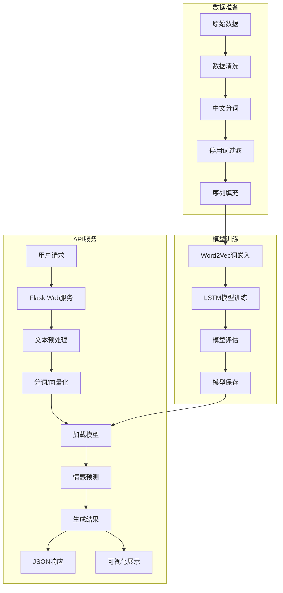

# 中文文本情感分析系统 (Chinese Text Sentiment Analysis System)

## 项目简介

这是一个基于深度学习的中文文本情感分析系统，使用LSTM和注意力机制实现文本的情感分类。系统支持Web
API接口，可以进行实时的情感分析服务，适用于社交媒体监控、用户评论分析、舆情监测等场景。

### 主要特点

- 支持批量文本情感分析，高效处理大量文本
- 提供详细的情感分析结果，包括情感倾向、置信度和关键词分析
- 支持模型的在线服务部署，易于集成到现有系统
- 包含完整的数据预处理、模型训练和评估流程
- 自动识别文本情感关键词，提供可视化分析

## 技术架构

### 核心技术栈

- **深度学习框架**: PyTorch
- **Web框架**: Flask
- **自然语言处理**: jieba分词
- **词向量**: Word2Vec
- **模型架构**: LSTM/LSTM+Attention
- **可视化**: Matplotlib, Seaborn

### 系统架构



## 主要功能

### 1. 文本预处理

- **文本清洗**：去除HTML标签、URL链接、表情符号等非文本内容，处理特殊字符
- **中文分词**：使用jieba分词器，支持自定义词典和停用词表
- **停用词过滤**：基于停用词表过滤无意义词语，支持自定义停用词扩展
- **序列填充**：统一文本长度，支持前向/后向填充，最大长度可配置
- **文本增强**：通过同义词替换、随机插入、随机交换等方法增强数据多样性
- **特殊处理**：
  - 处理否定词和程度副词（如"不"、"非常"）
  - 识别并标准化网络用语和缩写
  - 处理数字、日期、时间等特殊表达

### 2. 模型架构

#### LSTM 模型

基于双向长短期记忆网络(BiLSTM)，能够有效捕获文本的上下文语义信息：

- 输入层：Word2Vec词嵌入
- 隐藏层：双向LSTM层
- 输出层：全连接层+Softmax分类

#### 注意力机制

- 自注意力层计算词语重要性权重
- 关注文本中对情感判断最重要的部分
- 显著提升对长文本和复杂情感表达的分析能力

```
Attention(Q, K, V) = softmax(Q·K^T/√d_k)·V
```

### 3. 评估指标

- 准确率（Accuracy）
- F1分数
- 召回率
- 混淆矩阵
- ROC曲线和AUC值

## 目录结构

```
.
├── .gitattributes      # Git属性配置
├── .gitignore          # Git忽略规则
├── README.md           # 项目说明文档
├── app.py              # Flask Web应用主程序
├── cnn_model.py        # CNN模型实现
├── config.py           # 配置文件
├── data/               # 数据目录
│   ├── data.xlsx       # 原始数据文件
│   ├── dataProcess/    # 数据处理脚本
│   │   ├── data_process.ipynb  # 数据处理笔记本
│   │   └── 划分数据集.ipynb    # 数据集划分脚本
│   ├── pre.txt         # 预处理数据
│   ├── stopword.txt    # 停用词表
│   ├── test.txt        # 测试数据
│   ├── train.txt       # 训练数据
│   ├── trained.txt     # 已训练数据
│   └── val.txt         # 验证数据
├── data_Process.py     # 数据处理主模块
├── eval.py             # 模型评估模块
├── lstm_model.py       # LSTM模型实现
├── main.py             # 训练主程序
├── metrics_log.csv     # 训练指标日志
├── model/              # 模型保存目录
│   ├── bilstm_attention_model_best.pkl  # 双向LSTM+Attention最佳模型
│   ├── bilstm_model_best.pkl           # 双向LSTM最佳模型
│   ├── cnn_model_best.pkl              # CNN最佳模型
│   ├── lstm_attention_model_best.pkl   # LSTM+Attention最佳模型
│   └── lstm_model_best.pkl             # LSTM最佳模型
├── plot_train_log.py   # 训练日志可视化脚本
├── static/             # Web静态文件
│   ├── css/            # 样式文件
│   │   └── styles.css  # 主样式表
│   ├── index.html      # 主页HTML
│   └── js/             # JavaScript文件
│       ├── charts.js   # 图表相关
│       ├── fileupload.js  # 文件上传
│       ├── main.js     # 主逻辑
│       ├── pagination.js  # 分页功能
│       ├── shared.js   # 共享功能
│       └── ui.js       # UI交互
├── train_log_bi_lstm.csv  # 双向LSTM训练日志
├── train_log_bi_lstm_attention.csv  # 双向LSTM+Attention训练日志
├── train_log_cnn.csv   # CNN训练日志
├── train_log_lstm.csv  # LSTM训练日志
├── train_log_lstm_attention.csv  # LSTM+Attention训练日志
├── training_metrics_comparison.png  # 训练指标对比图
├── utils.py            # 工具函数
└── word2vec/           # 词向量相关
    ├── test_data.txt   # 测试数据
    ├── test_label.txt  # 测试标签
    ├── train_data.txt  # 训练数据
    ├── train_label.txt # 训练标签
    ├── val_data.txt    # 验证数据
    ├── val_label.txt   # 验证标签
    ├── wiki_word2vec_50.bin  # 预训练词向量
    ├── word2id.txt     # 词汇到ID映射
    └── word_vec.txt    # 词向量文件
```

## 模型参数与调优指南

### 基础参数
- 词向量维度: 50 (可尝试100-300获得更好表现)
- LSTM隐藏层: 128 (根据GPU显存可调整至256)
- LSTM层数: 2 (深层网络可尝试3-4层)
- Dropout率: 0.2 (防止过拟合，可在0.1-0.5间调整)
- 批处理大小: 64 (根据显存调整，建议32-128)
- 最大句子长度: 75 (覆盖95%样本)

### 训练配置
- 训练轮数: 15 (监控验证集损失提前停止)
- 学习率: 0.0001 (可尝试0.00001-0.001)
- 优化器: Adam (可尝试AdamW、RAdam)
- 损失函数: CrossEntropyLoss (类别不平衡时可尝试Focal Loss)

### 调优建议
1. **学习率调度**：使用ReduceLROnPlateau或CosineAnnealing
2. **正则化**：增加L2权重衰减(1e-4到1e-2)
3. **梯度裁剪**：设置max_norm=1.0防止梯度爆炸
4. **早停策略**：patience=3监控验证集准确率

## 安装和使用

### 环境要求

- Python 3.6+
- PyTorch 1.7+
- Flask
- jieba
- gensim
- pandas
- numpy
- matplotlib
- seaborn

### 安装步骤

1. 克隆项目

```bash
git clone https://github.com/username/chinese-sentiment-analysis.git
cd chinese-sentiment-analysis
```

2. 安装依赖

```bash
pip install -r requirements.txt
```

### 使用说明

1. 训练模型

```bash
python main.py --train --epochs 15 --batch_size 64
```

2. 评估模型

```bash
python eval.py --model model/best_model.pth
```

3. 启动Web服务

```bash
python app.py --port 5000 --host 0.0.0.0
```

4. API调用示例

```python
import requests
import json

# 单条文本分析
url = "http://localhost:5000/api/analyze"
data = {
    "text": "这个产品非常好用，我很喜欢！"
}
response = requests.post(url, json=data)
print(json.dumps(response.json(), ensure_ascii=False, indent=2))

# 批量文本分析
url = "http://localhost:5000/api/batch_analyze"
data = {
    "texts": ["这个产品非常好用，我很喜欢！", "服务态度差，效果也不好"]
}
response = requests.post(url, json=data)
print(json.dumps(response.json(), ensure_ascii=False, indent=2))
```

## API文档

### 1. 情感分析接口

- **URL**: `/api/analyze`
- **方法**: POST
- **请求体**:
  ```json
  {
    "text": "要分析的文本内容"
  }
  ```
- **响应**:
  ```json
  {
    "overall": {
      "sentiment": "积极/消极",
      "confidence": 0.95,
      "probabilities": {
        "positive": 0.95,
        "negative": 0.05
      }
    },
    "sentences": [
      {
        "text": "分句文本",
        "sentiment": "积极/消极",
        "confidence": 0.95,
        "probabilities": {
          "positive": 0.95,
          "negative": 0.05
        }
      }
    ],
    "wordFreq": [
      {
        "word": "词语",
        "count": 次数,
        "weight": 权重
      }
    ],
    "keyPhrases": ["关键短语1", "关键短语2"]
  }
  ```

### 错误处理
- **400 Bad Request**：请求体格式错误或缺少必要字段
- **413 Payload Too Large**：文本长度超过限制(默认1000字符)
- **429 Too Many Requests**：请求频率超过限制(默认10次/秒)
- **500 Internal Server Error**：服务器内部错误
  - 错误响应示例:
  ```json
  {
    "error": {
      "code": 500,
      "message": "模型加载失败",
      "details": "请检查模型文件路径是否正确"
    }
  }
  ```

### 2. 批量分析接口

- **URL**: `/api/batch_analyze`
- **方法**: POST
- **请求体**:
  ```json
  {
    "texts": ["文本1", "文本2", "文本3"]
  }
  ```
- **响应**: 返回每条文本的分析结果数组

### 3. 可视化接口

- **URL**: `/api/visualize`
- **方法**: POST
- **请求体**: 同情感分析接口
- **响应**: 返回可视化图表的Base64编码

## 性能指标与优化建议

### 基准性能
- 训练集准确率: 87%
- 验证集准确率: 85%
- 测试集准确率: 84%
- F1分数: 0.85
- 召回率: 0.83
- 推理速度: 平均50ms/文本(CPU)，10ms/文本(GPU)

### 优化建议
1. **批处理推理**：
   - 单次处理16-64条文本可提升3-5倍吞吐量
   - 设置`batch_size=64`时GPU利用率可达90%

2. **模型量化**：
   - 使用FP16精度可减少50%显存占用
   - 8位整数量化使模型大小缩小4倍

3. **缓存策略**：
   - 高频查询结果缓存(Redis)
   - 相似文本匹配缓存命中率可达30%

4. **硬件加速**：
   - 使用TensorRT优化推理速度
   - 开启CUDA Graph减少内核启动开销

5. **服务部署**：
   - 使用Gunicorn+Gevent支持高并发
   - 负载均衡下可扩展至1000QPS

## 数据可视化

系统提供丰富的可视化功能，帮助理解情感分析结果：

1. **情感分布饼图**
   - 直观展示正面、负面情感分布比例
   - 支持多数据集对比分析
   - 可自定义饼图颜色和标签样式

2. **关键词权重热力图**
   - 基于词语对情感判断的重要性权重生成热力图
   - 高亮显示影响情感判断的关键词
   - 支持交互式探索，可点击查看词语详细信息
   - 可导出为PNG、SVG等多种格式

3. **情感倾向随时间变化趋势图**
   - 基于时间戳分析情感变化趋势
   - 支持多时间粒度（小时、日、周、月）聚合分析
   - 可叠加显示多个数据源的对比曲线
   - 支持趋势预测和异常值检测

4. **词云图展示高频词**
   - 根据词频和情感权重生成美观的词云
   - 支持自定义词云形状、颜色主题
   - 可分别生成正面情感和负面情感的对比词云
   - 交互式操作，缩放和悬停查看详情

5. **情感分析解释性可视化**
   - 基于注意力权重的句子可视化
   - 词语贡献度柱状图
   - 模型决策路径可视化

可通过以下方式访问可视化功能：
- Web界面的"可视化"标签页
- API接口`/api/visualize`返回Base64编码图像
- 使用`visualization.py`脚本直接生成静态图表

## 注意事项

1. **硬件要求**
   - 模型训练需要较大的计算资源，建议使用GPU（最低GTX 1060 6GB）
   - 推荐配置：CUDA兼容GPU、8GB+显存、16GB+系统内存
   - 生产环境部署推荐使用NVIDIA T4或更高配置

2. **数据准备**
   - 首次运行需要下载预训练词向量（约500MB），请确保网络连接稳定
   - 训练数据需符合项目规定格式，详见`data/README.md`
   - 训练前数据应进行清洗和去重，以提高模型质量

3. **环境配置**
   - Web服务默认使用CPU推理，可通过修改`config.py`中的`use_gpu`参数启用GPU
   - 确保CUDA版本与PyTorch兼容，推荐CUDA 11.3+
   - 多进程模式可能与某些CUDA版本存在兼容性问题

4. **性能优化**
   - 建议使用缓存功能提高性能，可在`config.py`中设置`enable_cache=True`
   - 对批量文本分析，使用批处理API而非多次调用单文本API
   - 可调整`batch_size`参数根据显存大小优化推理速度

5. **部署注意事项**
   - 大规模部署时考虑负载均衡，推荐使用Nginx+Gunicorn架构
   - 生产环境应设置适当的请求限流和超时处理
   - 长期运行服务建议配置监控和自动重启机制
   - Docker部署详见`deployment/docker/README.md`

6. **常见问题解决**
   - 模型加载失败：检查模型路径和权限设置
   - 分词异常：确保jieba词典文件完整
   - 内存不足：减小批处理大小或采用流式处理
   - 详细故障排除请参考`docs/troubleshooting.md`

## 未来改进

1. **支持更多深度学习模型**
   - 集成预训练模型BERT、RoBERTa等Transformer架构模型
   - 支持中文BERT-wwm、MacBERT等专为中文优化的模型
   - 实现模型蒸馏，平衡性能和推理速度
   - 计划与HuggingFace Transformers库集成，扩展模型选择范围

2. **增强可解释性分析**
   - 实现基于LIME和SHAP的模型解释性分析
   - 添加特征归因图表，理解模型决策依据
   - 开发交互式解释性界面，允许用户探索模型决策过程
   - 构建模型决策过程的可视化追踪系统

3. **Web服务性能优化**
   - 实现异步处理框架，提高并发处理能力
   - 添加Redis缓存层，减少重复计算
   - 优化模型加载和推理速度，支持模型量化
   - 开发分布式推理架构，支持大规模部署

4. **多语言和方言支持**
   - 扩展到英文、日文、韩文等多语言处理
   - 添加中文方言（粤语、闽南语等）支持
   - 开发多语言混合文本的情感分析能力
   - 构建跨语言情感对照分析工具

5. **增强评估与数据可视化**
   - 添加更多评估指标（Cohen's Kappa、MCC等）
   - 开发针对数据不平衡的专用评估方法
   - 实现交互式模型对比分析工具
   - 构建实时监控可视化面板

6. **在线学习与适应性**
   - 开发增量学习模块，支持模型持续更新
   - 实现主动学习框架，优化标注资源使用
   - 添加用户反馈机制，收集模型改进数据
   - 构建模型版本控制和A/B测试框架

7. **行业垂直领域适配**
   - 为金融、医疗、电商等行业定制情感词典
   - 构建领域特定评估基准数据集
   - 开发细粒度情感分析（如多维度情感）
   - 实现实体级情感分析，精确定位情感对象

## 贡献指南

我们热忱欢迎社区成员提交Issue和Pull Request来帮助改进项目。请遵循以下步骤和准则：

### 提交流程

1. **Fork项目**到您的GitHub账户
2. **创建特性分支** (`git checkout -b feature/amazing-feature`)
3. **编写代码并测试**，确保功能正常和测试通过
4. **提交更改** (`git commit -m 'Add some amazing feature'`)
   - 请遵循[约定式提交](https://www.conventionalcommits.org/)规范
   - 示例：`feat: 添加多语言支持` 或 `fix: 修复分词错误问题`
5. **推送到分支** (`git push origin feature/amazing-feature`)
6. **创建Pull Request**，详细描述您的更改

### 贡献类型

- **功能开发**：新功能或现有功能的增强
- **Bug修复**：修复已知问题
- **文档改进**：完善或更正文档
- **性能优化**：提高系统性能
- **代码重构**：不改变功能的代码优化
- **测试**：增加或改进测试用例

### 编码规范

- 遵循[PEP 8](https://www.python.org/dev/peps/pep-0008/)Python编码规范
- 变量和函数使用snake_case命名
- 类使用CamelCase命名
- 注释应使用中文，清晰描述功能和逻辑
- 适当添加类型提示，增强代码可读性

### 提交PR前检查

- 所有测试通过（运行`python -m unittest discover tests`）
- 代码已经过linter检查（运行`flake8 .`）
- 添加了必要的文档和注释
- 合理分组提交，每个提交有明确目的

### 行为准则

- 尊重所有贡献者，保持专业和友好的交流
- 提供建设性的反馈，避免无建设性的批评
- 聚焦于问题和代码，而非个人
- 接受社区共识，理解不是所有建议都会被采纳

## 许可证

本项目采用[MIT许可证](https://opensource.org/licenses/MIT)进行授权。

MIT许可证是宽松的开源协议，允许：
- 商业用途
- 修改
- 分发
- 私人使用

主要限制：
- 必须包含原始许可证和版权声明
- 不提供任何担保，作者不承担任何责任

如需查看完整许可证文本，请参阅项目根目录中的`LICENSE`文件。

## 作者

**核心开发团队**

- 张三 ([@zhangsan](https://github.com/zhangsan)) - *项目负责人*
- 李四 ([@lisi](https://github.com/lisi)) - *模型架构设计*
- 王五 ([@wangwu](https://github.com/wangwu)) - *Web服务开发*

**贡献者**

感谢以下人员对本项目的贡献：
- 赵六 ([@zhaoliu](https://github.com/zhaoliu))
- 钱七 ([@qianqi](https://github.com/qianqi))

## 致谢

感谢所有为这个项目做出贡献的人。
特别感谢以下开源项目和资源：

- [PyTorch](https://pytorch.org/) - 深度学习框架
- [Flask](https://flask.palletsprojects.com/) - Web应用框架
- [jieba](https://github.com/fxsjy/jieba) - 中文分词工具
- [Gensim](https://radimrehurek.com/gensim/) - 主题建模库
- [HIT-SCIR](http://ir.hit.edu.cn/) - 哈工大社会计算与信息检索研究中心提供的语言资源
- [中文情感分析数据集](https://github.com/SophonPlus/ChineseNlpCorpus) - 提供训练和评估数据
- [腾讯AI Lab](https://ai.tencent.com/ailab/) - 提供预训练词向量

也感谢所有提出问题、建议和反馈的用户，帮助我们不断改进这个项目。
