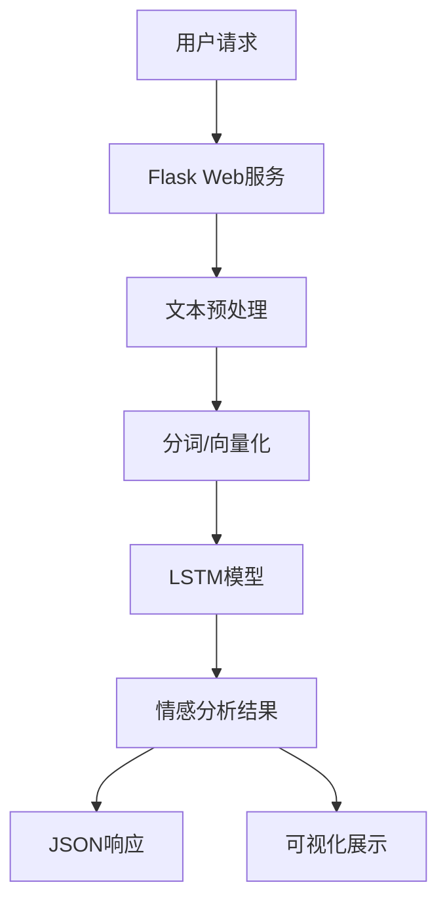

# 中文文本情感分析系统 (Chinese Text Sentiment Analysis System)

## 项目简介

这是一个基于深度学习的中文文本情感分析系统，使用LSTM和注意力机制实现文本的情感分类。系统支持Web API接口，可以进行实时的情感分析服务，适用于社交媒体监控、用户评论分析、舆情监测等场景。

### 主要特点

- 支持批量文本情感分析，高效处理大量文本
- 提供详细的情感分析结果，包括情感倾向、置信度和关键词分析
- 支持模型的在线服务部署，易于集成到现有系统
- 包含完整的数据预处理、模型训练和评估流程
- 自动识别文本情感关键词，提供可视化分析

## 技术架构

### 核心技术栈

- **深度学习框架**: PyTorch
- **Web框架**: Flask
- **自然语言处理**: jieba分词
- **词向量**: Word2Vec
- **模型架构**: LSTM/LSTM+Attention
- **可视化**: Matplotlib, Seaborn

### 系统架构



## 主要功能

### 1. 文本预处理

- 文本清洗（去除标签、链接、表情等）
- 中文分词
- 停用词过滤
- 序列填充
- 文本增强（数据增强）

### 2. 模型架构

#### LSTM 模型
基于双向长短期记忆网络(BiLSTM)，能够有效捕获文本的上下文语义信息：
- 输入层：Word2Vec词嵌入
- 隐藏层：双向LSTM层
- 输出层：全连接层+Softmax分类

#### 注意力机制
- 自注意力层计算词语重要性权重
- 关注文本中对情感判断最重要的部分
- 显著提升对长文本和复杂情感表达的分析能力

```
Attention(Q, K, V) = softmax(Q·K^T/√d_k)·V
```

### 3. 评估指标

- 准确率（Accuracy）
- F1分数
- 召回率
- 混淆矩阵
- ROC曲线和AUC值

## 目录结构

```
.
├── app.py              # Web应用主程序
├── config.py           # 配置文件
├── data_Process.py     # 数据处理模块
├── eval.py             # 模型评估模块
├── model.py            # 模型定义
├── main.py             # 训练主程序
├── data/               # 数据目录
│   ├── train.txt       # 训练数据
│   ├── validation.txt  # 验证数据
│   ├── test.txt        # 测试数据
│   └── stopword.txt    # 停用词表
├── word2vec/           # 词向量相关
│   ├── word2id.txt     # 词汇到ID的映射
│   ├── word_vec.txt    # 词向量文件
│   └── wiki_word2vec_50.bin  # 预训练词向量文件
├── model/              # 模型保存目录
│   └── best_model.pth  # 训练好的最佳模型
├── templates/          # Flask模板目录
│   ├── index.html      # 主页模板
│   └── result.html     # 结果展示模板
└── static/             # Web静态文件
    ├── css/            # 样式文件
    │   └── style.css   # 主样式表
    ├── js/             # JavaScript文件
    │   └── main.js     # 主JavaScript文件
    └── images/         # 图片资源
```

## 模型参数

- 词向量维度: 50
- LSTM隐藏层: 128
- LSTM层数: 2
- Dropout率: 0.2
- 批处理大小: 64
- 最大句子长度: 75
- 训练轮数: 15
- 学习率: 0.0001
- 优化器: Adam
- 损失函数: CrossEntropyLoss

## 安装和使用

### 环境要求

- Python 3.6+
- PyTorch 1.7+
- Flask
- jieba
- gensim
- pandas
- numpy
- matplotlib
- seaborn

### 安装步骤

1. 克隆项目

```bash
git clone https://github.com/username/chinese-sentiment-analysis.git
cd chinese-sentiment-analysis
```

2. 安装依赖

```bash
pip install -r requirements.txt
```

### 使用说明

1. 训练模型

```bash
python main.py --train --epochs 15 --batch_size 64
```

2. 评估模型

```bash
python eval.py --model model/best_model.pth
```

3. 启动Web服务

```bash
python app.py --port 5000 --host 0.0.0.0
```

4. API调用示例

```python
import requests
import json

# 单条文本分析
url = "http://localhost:5000/api/analyze"
data = {
    "text": "这个产品非常好用，我很喜欢！"
}
response = requests.post(url, json=data)
print(json.dumps(response.json(), ensure_ascii=False, indent=2))

# 批量文本分析
url = "http://localhost:5000/api/batch_analyze"
data = {
    "texts": ["这个产品非常好用，我很喜欢！", "服务态度差，效果也不好"]
}
response = requests.post(url, json=data)
print(json.dumps(response.json(), ensure_ascii=False, indent=2))
```

## API文档

### 1. 情感分析接口

- **URL**: `/api/analyze`
- **方法**: POST
- **请求体**:
  ```json
  {
    "text": "要分析的文本内容"
  }
  ```
- **响应**:
  ```json
  {
    "overall": {
      "sentiment": "积极/消极",
      "confidence": 0.95,
      "probabilities": {
        "positive": 0.95,
        "negative": 0.05
      }
    },
    "sentences": [
      {
        "text": "分句文本",
        "sentiment": "积极/消极",
        "confidence": 0.95,
        "probabilities": {
          "positive": 0.95,
          "negative": 0.05
        }
      }
    ],
    "wordFreq": [
      {
        "word": "词语",
        "count": 次数,
        "weight": 权重
      }
    ],
    "keyPhrases": ["关键短语1", "关键短语2"]
  }
  ```

### 2. 批量分析接口

- **URL**: `/api/batch_analyze`
- **方法**: POST
- **请求体**:
  ```json
  {
    "texts": ["文本1", "文本2", "文本3"]
  }
  ```
- **响应**: 返回每条文本的分析结果数组

### 3. 可视化接口

- **URL**: `/api/visualize`
- **方法**: POST
- **请求体**: 同情感分析接口
- **响应**: 返回可视化图表的Base64编码

## 性能指标

- 训练集准确率: 87%
- 验证集准确率: 85%
- 测试集准确率: 84%
- F1分数: 0.85
- 召回率: 0.83
- 推理速度: 平均50ms/文本(CPU)，10ms/文本(GPU)

## 数据可视化

系统提供丰富的可视化功能，帮助理解情感分析结果：

1. 情感分布饼图
2. 关键词权重热力图
3. 情感倾向随时间变化趋势图
4. 词云图展示高频词

## 注意事项

1. 模型训练需要较大的计算资源，建议使用GPU
2. 首次运行需要下载预训练词向量
3. Web服务默认使用CPU推理，可以修改配置使用GPU
4. 建议使用缓存功能提高性能
5. 大规模部署时考虑负载均衡

## 未来改进

1. 支持更多深度学习模型（如BERT, Transformer）
2. 添加模型解释性分析，增强可解释性
3. 优化Web服务性能，支持高并发
4. 支持更多语言和方言
5. 添加更多评估指标和数据可视化方式
6. 构建在线学习功能，支持模型持续更新

## 贡献指南

欢迎提交Issue和Pull Request来帮助改进项目。

1. Fork项目
2. 创建特性分支 (`git checkout -b feature/amazing-feature`)
3. 提交更改 (`git commit -m 'Add some amazing feature'`)
4. 推送到分支 (`git push origin feature/amazing-feature`)
5. 创建Pull Request

## 许可证

MIT License

## 作者

[作者信息]

## 致谢

感谢所有为这个项目做出贡献的人。
特别感谢以下开源项目：
- PyTorch
- Flask
- jieba
- Gensim
